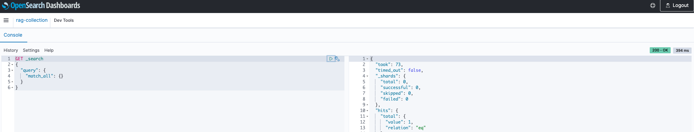

# RAG with Amazon Bedrock and OpenSearch

Opinionated sample on how to configure and deploy RAG (Retrieval Augmented Generation) application.

It is comprised of a few core pieces:

- **Amazon Bedrock** as the managed service providing easy API-based access to foundation models (FMs).
- **Amazon OpenSearch Service**, an open-source alternative to using Amazon Kendra.
- **LangChain** as a Large Language Model (LLM) application framework. It updates the OpenSearch index when new documents are added to the knowledgebase S3 bucket.
- **Amazon Elastic Container Service (ECS)** to run the RAG Application.
- **Streamlit** for the frontend user interface of the RAG Application.
- **Application Load Balancer** to route HTTPS traffic to the ECS service (which is running the RAG App).
- **Amazon Cognito** for secure user authentication.

This sample is inspired by another sample demonstrating similar functionality with PGVector (instead of OpenSearch).

## Code and Operations

- Code
- Issues
- Pull requests
- Actions
- Projects
- Security
- Insights

## Vector Database

Vector database is an essential component of any RAG application. The LLM framework uses the vector data store to search for information based on the user's question.

A typical assumption (and a strong constraint on this sample project) is that a knowledgebase comprises PDF documents stored somewhere. Ideally, a true knowledgebase would encompass more - such as scraping websites and wiki pages. But to limit the scope, the knowledgebase in this sample is an S3 bucket containing PDF documents.

A popular choice for vector databases in an AWS-based RAG app is Amazon Kendra. It performs optical character recognition (OCR) for PDFs and integrates seamlessly with AWS Services like S3. Additionally, Amazon Bedrock offers a vector database as "Knowledgebases".

**Note:** "Bedrock Knowledgebases" is another vector store offering; it should not be confused with the term "knowledgebase" or "knowledgebase bucket" which refers to the S3 bucket containing PDF documents in this project.

However, the purpose of this sample is to show how to set up an open-source vector database. Since Kendra and Bedrock Knowledgebases are not open source, this sample focuses on OpenSearch. Unlike Kendra, OpenSearch cannot directly query PDF documents, so text must be extracted and fed to OpenSearch.


---

## How It Works

PDF files will land in the knowledgebase S3 bucket either by manual upload via the console, programmatic upload via the AWS CLI, or by running `cdk deploy BaseInfraStack`. **Note:** The last option requires placing the PDF files in the "knowledgebase" directory of this project. The S3 Bucket Deployment construct will then upload these files to the knowledgebase bucket.

Upon arrival in the knowledgebase S3 bucket, S3 Event Notifications trigger a Lambda function to extract text from the PDF file(s) and upload the converted text files into the "processed text S3 Bucket". The conversion logic is located in the `lambda/pdf-processor` directory, using the `pypdf` Python Library for text extraction.

Subsequently, another S3 Event Notification triggers another Lambda function (`aoss-trigger`) to extract file information and push it to an Amazon SQS queue. The message in the SQS queue, in turn, triggers another Lambda function (`aoss-update`) that updates the vector database with the contents of the processed text file for indexing. It utilizes the `S3FileLoader` component from LangChain for extracting document contents to feed OpenSearch.


Embeddings convert words and sentences into numbers capturing their meanings and relationships. In RAG, "vector embeddings" aid in "similarity search" capabilities. Adding documents to an OpenSearch index requires the creation/provisioning of embeddings. This project/sample uses OpenAI's Embeddings, and API Key access will be required to build/run this app in your AWS environment.

**Note:** If you wish to use alternative embeddings, you must adjust the code in the `rag-app` and `aoss-update` Lambda functions accordingly.

## Deployment

### Pre-Requisites

- **AWS CLI:** Install with `pip install awscli` (requires Python).
- **Docker:** You must have Docker installed. Options include:
  - Docker Desktop
  - Rancher Desktop
  - Finch (MacOS only)
- **OpenAI API Key:** Required for embedding feature. Create an account with OpenAI if needed.
- **npm:** Required for TypeScript/JavaScript projects. Installation instructions are [here](https://nodejs.org/).
- **IAM Self-Signed Server Certificate:** Set the `IAM_SELF_SIGNED_SERVER_CERT_NAME` environment variable for a self-signed server certificate.

### Self-Signed SSL Certificate

Run the `self-signed-cert-utility.py` script located in the scripts directory to create a self-signed certificate, then upload its contents to AWS via Boto3 API calls. This is necessary because the Application Load Balancer requires SSL certificates for HTTP functionality.
```

```markdown
If the script runs successfully, you should see a JSON-like object printed out in the log output with parameters like `ServerCertificateName`, `ServerCertificateId`, `Arn` etc. Moreover, the `HTTPStatusCode` should have the value 200.

The parameters encoded in the certificate are in a JSON file. By default, it expects a file named `default_cert_parameters.json` unless otherwise specified. You may change the values of the default JSON file if you wish to. If you wish to use your own config file (instead of the default), you can do so by specifying the `--config-file` parameter.

```bash
export IAM_SELF_SIGNED_SERVER_CERT_NAME=<name you want to give to your ssl cert>
# switch to the self-signed-cert-utility directory
cd scripts/self-signed-cert-utility
# create a python3 virtual environment (highly recommended)
python3 -m virtualenv .certenv
# activate the virtual environment
source .certenv/bin/activate
# for a different shell like fish, just add a `.fish` at the end of the previous command
# install requirements
pip install -r requirements.txt
# run the script
python self-signed-cert-utility.py
# optionally specify a `--profile` if you're not using the default AWS profile
# deactivate virtual environment
deactivate
# return to the root directory of the project
cd -
```

You can also specify a custom domain for the certificate by setting the `APP_DOMAIN` environment variable.

**NOTE** - An alternative would be to use the AWS Certificates Manager but it requires additional steps (in the form of creating and registering your own domain, involve Route53 hosted zones, etc). Since the focus of this sample is to show deployment of a RAG app, and not registering domains, it does not get into configuring that bit.

Set the `COGNITO_DOMAIN_NAME` environment variable. This will be the domain of the Cognito hosted UI which will be used to "log-in" and/or "sign-up" into the app. The default value is defined in the `base-infra-stack.ts`.

Bootstrapping provisions resources in your environment such as an Amazon Simple Storage Service (Amazon S3) bucket for storing files and AWS Identity and Access Management (IAM) roles that grant permissions needed to perform deployments. These resources get provisioned in an AWS CloudFormation stack, called the bootstrap stack. It is usually named `CDKToolkit`. Like any AWS CloudFormation stack, it will appear in the AWS CloudFormation console of your environment once it has been deployed. More details can be found here.

**NOTE** - You only need to do this once per account. If there are other CDK projects deployed in your AWS account, you won't need to do this.

Define the domain name for the Cognito hosted UI [Optional]

```bash
export COGNITO_DOMAIN_NAME=<name you want to give to your cognito hosted ui domain>
```

Install dependencies (if not already done)

```bash
npm install
```

Bootstrap CDK environment (if not already done)

```bash
npx cdk bootstrap
# You can optionally specify `--profile` at the end of that command if you wish to not use the default AWS profile.
```

Depending on the architecture of your computer, you may need to set this environment variable for the docker container. This is because docker containers are dependent on the architecture of the host machine that is building/running them. If your machine runs on the x86 architecture, you can ignore this step.

This will deploy the base infrastructure - consisting of a VPC, Application Load Balancer for the app, S3 buckets (for knowledgebase, and the processed text), Lambda functions to process the PDF documents, some SQS queues for decoupling, a Secret credential for the OpenAI API key, Cognito user pool and some more bits and pieces of the cloud infrastructure. The CDK code for this is in the `lib` directory within the `base-infra-stack.ts` file.

The secret was created after the deployment of the `BaseInfraStack` but the value inside it is not valid. You can either enter your OpenAI API key via the AWS Secrets Manager console; or you could use the `api-key-secret-manager-upload.py` script to do that for you. AWS Secrets Manager is the recommended way to store credentials in AWS, as it provides API-based access to credentials for databases etc. Since OpenAI is an external service and has its own API keys, we need to manually upload that key to Secrets Manager so that the app infrastructure can access it securely.

If you are on an M1/M2 Mac, set the environment variable:

```bash
export DOCKER_CONTAINER_PLATFORM_ARCH=arm
```

Deploy the `BaseInfraStack`

```bash
npx cdk deploy BaseInfraStack
# You can optionally specify `--profile` at the end of that command if you wish to not use the default AWS profile.
```

Upload the OpenAI API key to Secrets Manager

```bash
# switch to the api-key-secret-manager-upload directory
cd scripts/api-key-secret-manager-upload
# create a python3 virtual environment (highly recommended)
python3 -m virtualenv .keyenv
# activate the virtual environment
source .keyenv/bin/activate
# for a different shell like fish, just add a `.fish` at the end of the previous command
# install requirements
pip install -r requirements.txt
# run the script; optionally specify a `--profile` if you're not using the default AWS profile
python api-key-secret-manager-upload.py -s openAiApiKey
```

The script will prompt you to enter your OpenAI API key. It uses the `getpass` Python library so that you don't have to enter it in plain text.

**NOTE** - The instructions specify `-s openAiApiKey`. It is the same name as defined in the `base-infra-stack.ts`. If you change the value there, you will need to change the value whilst running the script too.

Deploy the `TestComputeStack`

```bash
npx cdk deploy TestComputeStack
# You can optionally specify `--profile` at the end of that command if you wish to not use the default AWS profile.
```

Deploy the OpenSearch stack

This will deploy an Amazon managed OpenSearch serverless collection - specialized to do Vector Searches. It simplifies management of the OpenSearch cluster. Additionally, it will create and attach network security policies, encryption security policies, and data access policies to the collection.

Note that this Serverless connection has "AllowFromPublic" set to True. This enables you to easily access the OpenSearch Dashboard from the Amazon OpenSearch Service console.
```
# Deploying the OpenSearch Stack

To review the OpenSearch deployment, you can log in to the AWS Console and click on the Dashboard URL that was created as part of deploying the OpenSearch stack.

If you don't set the `OPENSEARCH_COLLECTION_NAME` environment variable, the default name of the collection will be "rag-collection". You can change the default collection name if desired. This will deploy a Lambda function that updates the OpenSearch index whenever a new document lands in the processed text bucket.

```bash
npx cdk deploy OpenSearchStack
```

You can optionally specify `--profile` at the end of the command if you wish to use a different AWS profile.

## Deploying the OpenSearch Update Stack

```bash
npx cdk deploy aossUpdateStack
```

You can optionally specify `--profile` at the end of the command if you wish to use a different AWS profile.

---

**GitHub Documentation Link**

[rag-with-amazon-bedrock-and-opensearch/README.md](https://github.com/aws-samples/rag-with-amazon-bedrock-and-opensearch/blob/main/README.md)

---


## Deploying the ECS Fargate Service

This will deploy the ECS Fargate service running the code for the RAG Application. It will also add this service as a target to the Application Load Balancer defined in the "BaseInfraStack". The CDK infrastructure code for this stack is in the `rag-app-stack.ts` file in the `lib` directory.

This app leverages LangChain for interacting with Bedrock and OpenSearch; and Streamlit for the frontend user interface. The application code is in the `rag-app` directory.

### Completing Infrastructure Setup

After deploying the "RagStack", the necessary infrastructure is complete. However, you still need to populate the knowledge base S3 bucket. You can do this manually by uploading files through the console or adding PDF files to the knowledge base directory in this project and then running:

```bash
npx cdk deploy BaseInfraStack
```

Choosing this option allows tracking knowledge base documents in source control if desired. This will upload the document(s) to the Knowledgebase S3 bucket using the S3 Bucket Deployment construct. Once the upload to the S3 knowledge base bucket is complete, it triggers the `pdf-processor` Lambda function to extract text from the PDF and upload it to the processed text S3 bucket.

An upload to the processed text bucket triggers the `aoss-update` Lambda function to add the document to the OpenSearch index. You can verify additions by making API calls to the OpenSearch endpoint or via the dashboard as shown below.

## Deploying the RAG App Stack

```bash
npx cdk deploy ragStack
```

You can optionally specify `--profile` at the end of the command if you wish to use a different AWS profile.

### Adding Documents to the Knowledge Base

Adding documents to the knowledge base S3 bucket enables testing of the app.

---

**GitHub Documentation Link**

[rag-with-amazon-bedrock-and-opensearch/README.md](https://github.com/aws-samples/rag-with-amazon-bedrock-and-opensearch/blob/main/README.md)

---

## Testing the RAG App

After adding document(s) to the knowledge base, you can now test the app. Log in to the AWS Console and navigate to the EC2 section to find the Application Load Balancer page. Select the load balancer created as part of the "BaseInfraStack." The load balancer should have a "DNS name." Typing `https://<DNS_NAME>` in your browser should direct you to the app.

**Note:** Since a self-signed SSL certificate (via IAM Server Certificates) is used, your browser might show a warning. Click on advanced and proceed to the URL to be directed to the Login UI (served via Cognito):

---




---

You can sign up for a new user in this console, or create a user in the AWS Console via the Cognito service. Alternatively, users can be created programmatically via the SDK or using an open-source helper utility.

---


---

Upon successful sign-in (or sign-up), you will see the UI and can start asking questions based on the documents uploaded. For example, the application can provide answers to questions like "What is AWS?" based on the 2021 Amazon letter to shareholders.

## Miscellaneous Notes / Technical Hiccups / Recommendations

---


---

### Cognito Callback URL Hiccup

The DNS name generated during application load balancer creation through Infrastructure as Code (IaC) may contain random characters including both UPPER CASE and lower case. This becomes an issue when configuring with the Cognito User Pool Integration as Cognito does not accept UPPER CASE characters in the Callback URL. The project has Eventbridge triggers to address this issue by invoking a Lambda function that updates the app client via the `update_user_pool_client` `boto3` API call with a lower case DNS name.

### Production Environment Recommendations

- Register your own domain to host the app.
- Use AWS Certificates Manager to generate a self-signed certificate and link it with a Route53 hosted zone. Refer to AWS Documentation for further details.
- Streamlit is recommended for quick UI deployment but may not suit production if more functionalities are to be added. For a decoupled approach, consider AWS Amplify; running the backend as a Lambda Function with API Gateway could be beneficial.

### Alternate Vector Embedding Providers

Using providers like HuggingFace or Amazon Titan would require code changes, specifically in the Lambda function(s) updating the OpenSearch index via LangChain and the ECS application running the RAG app.

### Model Configuration

The sample uses Anthropic's Claude V1 Instant. The model can be changed by setting the `FOUNDATION_MODEL_ID` environment variable in the `rag-app-stack.ts`. Model IDs can be found in the AWS Documentation.

### Key Concepts / Techniques

- OpenSearch as a vector database for RAG applications
- Using LangChain for serving a RAG application and updating OpenSearch index
- Application Load Balancer (ALB) and ECS Fargate Service for application hosting

---

*Note: The original document structure has been retained with improvements in formatting and consistency.*
```markdown
# Self-Signed Certificates to Configure the HTTPS Listener for the ALB

**05/06/2025, 17:40**

[rug-with-amazon-bedrock-and-opensearch/README.md at main · aws-samples/rag-with-amazon-bedrock-and-opensearch · GitHub](https://github.com/aws-samples/rag-with-amazon-bedrock-and-opensearch/blob/main/README.md)

14/15

---

## Integrating a Cognito Login UI with the ALB

This is a blank project for CDK development with TypeScript.

The `cdk.json` file tells the CDK Toolkit how to execute your app.

### Useful Commands

- `npm run build` - Compile TypeScript to JavaScript.
- `npm run watch` - Watch for changes and compile.
- `npm run test` - Perform the Jest unit tests.
- `cdk deploy` - Deploy this stack to your default AWS account/region.
- `cdk diff` - Compare deployed stack with current state.
- `cdk synth` - Emit the synthesized CloudFormation template.

### Generic CDK Instructions

**05/06/2025, 17:40**

[rug-with-amazon-bedrock-and-opensearch/README.md at main · aws-samples/rag-with-amazon-bedrock-and-opensearch · GitHub](https://github.com/aws-samples/rag-with-amazon-bedrock-and-opensearch/blob/main/README.md)

15/15