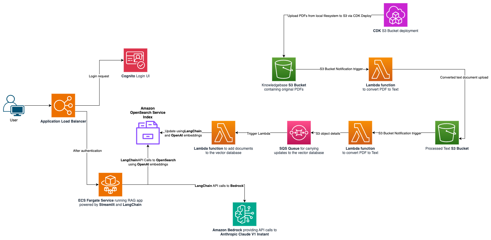
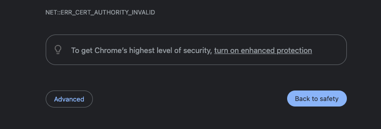
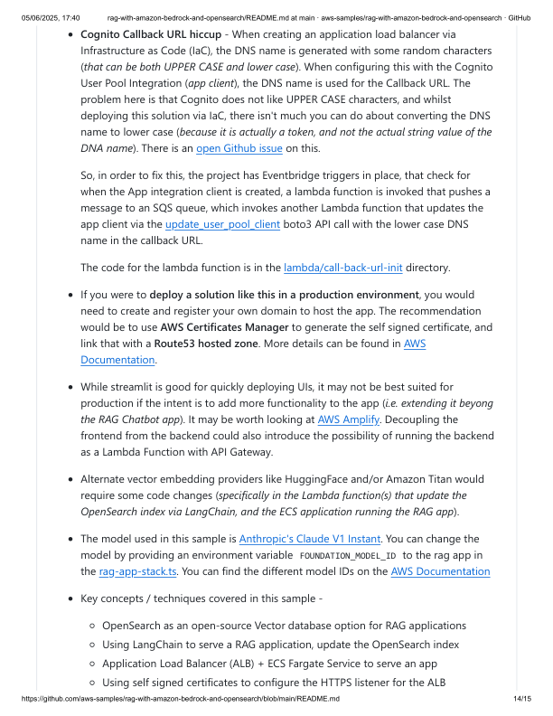

# RAG with Amazon Bedrock and OpenSearch

**Public Repository**  
- Repository Name: `rag-with-amazon-bedrock-and-opensearch`
- File Path: `rag-with-amazon-bedrock-and-opensearch/README.md`
- Last Update: tanveerg updated the readme · 8963228 · last year
- Lines: 346 (201 loc) · Size: 26.1 KB

## Overview

Opinionated sample on how to configure and deploy a RAG (Retrieval Augmented Generation) application. It is comprised of a few core components:

- **Amazon Bedrock:** Provides easy API-based access to foundation models (FMs).
- **Amazon OpenSearch Service:** Open-source alternative to Amazon Kendra.
- **LangChain:** LLM application framework for updating the OpenSearch index when new documents are added to the knowledgebase S3 bucket.
- **Amazon Elastic Container Service (ECS):** Runs the RAG Application.
- **Streamlit:** Frontend user interface of the RAG Application.
- **Application Load Balancer:** Routes HTTPS traffic to the ECS service (which is running the RAG App).
- **Amazon Cognito:** Provides secure user authentication.

This sample is inspired by another sample that demonstrates similar functionality with PGVector instead of OpenSearch.

## Vector Database

A vector database is an essential component of any RAG application. The LLM framework uses the vector data store to search for information based on user questions.

A typical assumption in this sample project is that a knowledgebase would comprise PDF documents stored somewhere, usually an S3 bucket. To limit scope, the knowledgebase in this sample is an S3 bucket containing PDF documents. Amazon Kendra is a popular choice for vector databases in an AWS-based RAG app and performs OCR for PDFs.

**Note:** "Bedrock Knowledgebases" is another vector store offering, distinct from the "knowledgebase bucket" in this project.

This sample shows how to set up an open-source vector database using OpenSearch, which requires text extraction from PDFs before indexing.

## Architecture

The expectation is that PDF files will land in the knowledgebase S3 bucket either manually via the console, programmatically via the AWS CLI, or through `cdk deploy BaseInfraStack`. The last option requires placing PDF files in the "knowledgebase" directory, and the S3 Bucket Deployment construct will upload these files.

Upon arrival in the S3 bucket, S3 Event Notifications trigger a Lambda function to extract text from PDFs, uploading the text files into the "processed text S3 Bucket". The logic for this Lambda is in the `lambda/pdf-processor` directory, using the `pypdf` Python Library.

After processing, another S3 Event Notification triggers another Lambda function (`aoss-trigger`), pushing information to an Amazon SQS queue. This message initiate another Lambda function (`aoss-update`) which updates the vector database with content for indexing via the `S3FileLoader` component from LangChain.

Embeddings convert words and sentences into numerical representations for similarity search capabilities. This project uses OpenAI's Embeddings, requiring an account and API Key.

Additional embedding options:
- **HuggingFace**
- **Amazon Titan**

**Note:** Using alternative embeddings requires code changes in the `rag-app` and `aoss-update` Lambda function.

## OpenSearch Orchestration

This project is divided into sub-stacks requiring additional deployment steps using AWS CDK (IaC). As this is a TypeScript CDK project, `npm` should be installed.

Pre-requisites include:
- **Install AWS CLI** (`pip install awscli`). You need Python installed. Configure and authenticate AWS CLI interaction.
- **Install Docker:** Options include Docker Desktop, Rancher Desktop, and Finch.
- **OpenAI API Key:** Create an account with OpenAI for embedding use.
- **Set `IAM_SELF_SIGNED_SERVER_CERT_NAME`:** Name of the self-signed server certificate created via IAM during deployment.

## Deploying the App

Create a self-signed SSL certificate by running the `self-signed-cert-utility.py` script in the scripts directory.
```

```markdown
## Document Images











```

Note: The document already seems correctly structured, so no further changes were needed beyond ensuring the markdown syntax is properly formatted.