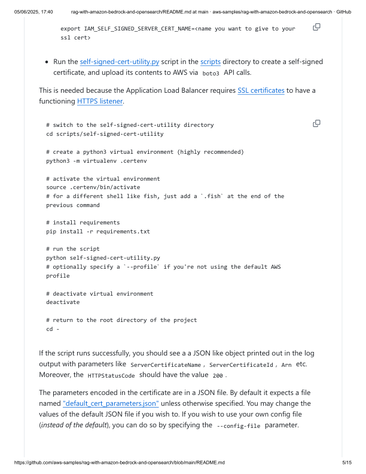
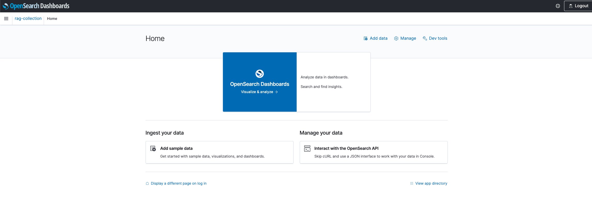
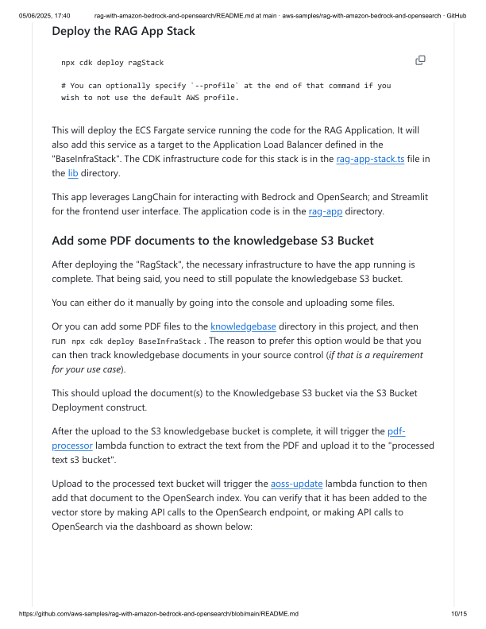

aws-samples / rag-with-amazon-bedrock-and-opensearch
Public
rag-with-amazon-bedrock-and-opensearch / README.md
tanveerg update readme
8963228 · last year
346 lines (201 loc) · 26.1 KB
Opinionated sample on how to configure and deploy RAG (Retrieval Augmented
Generation) application.
It is comprised of a few core pieces:
Amazon Bedrock as the managed service providing easy API based access to
foundation models (FMs).
Amazon OpenSearch Service. This is an open-source alternative to using Amazon
Kendra.
LangChain as a Large Language Model (LLM) application framework. It has also been
used to update the OpenSearch index when new documents get added to the
knowledgebase S3 bucket.
Amazon Elastic Container Service (ECS) to run the RAG Application.
Streamlit for the frontent user interface of the RAG Application.
Application Load Balancer to route HTTPS traffic to the ECS service (which is running
the RAG App).
Amazon Cognito for secure user authentication.
This sample is inspired by another sample that demonstrates a similar functionality with
PGVector (instead of OpenSearch).
Code
Issues
Pull requests
1
Actions
Projects
Security
Insights
RAG with Amazon Bedrock and OpenSearch
Preview
Code
Blame
Raw
05/06/2025, 17:40
rag-with-amazon-bedrock-and-opensearch/README.md at main · aws-samples/rag-with-amazon-bedrock-and-opensearch · GitHub
https://github.com/aws-samples/rag-with-amazon-bedrock-and-opensearch/blob/main/README.md
1/15

Vector database is an essential component of any RAG application. The LLM framework
uses the vector data store to search for information based on the question that comes
from the user.
Typical assumption (and a strong constraint on this sample project) is that a knowledgebase
would comprise of PDF documents stored somewhere. Ideally, a true knowledgebase
would encompass a lot more - would scrape websites, wiki pages and so on. But to limit
the scope of this sample, the knowledgebase is an S3 bucket containing a bunch of PDF
documents.
A popular choice for vector database in an AWS based RAG app is Amazon Kendra. It does
optical character recognition (OCR) for PDFs under the hood. It is a fully managed search
service with seemless integration with AWS Services like S3. Additionally, Amazon Bedrock
also has a vector database offering in the form of "Knowledgebases".
NOTE - "Bedrock Knowledgebases" is another vector store offering; and it should not be
confused with the term "knowledgebase" and/or "knowledgebase bucket" which refers to
the S3 bucket containing PDF documents in this project.
However, the purpose of this sample was to show how to set up an open-source vector
database, and since Kendra and Bedrock Knowledgebases are not open source, this sample
focuses on OpenSearch. Unlike Kendra, OpenSearch cannot directly query PDF documents,
so we need to extract the text, and then feed the text to OpenSearch.
Architecture
Short note on vector data stores
05/06/2025, 17:40
rag-with-amazon-bedrock-and-opensearch/README.md at main · aws-samples/rag-with-amazon-bedrock-and-opensearch · GitHub
https://github.com/aws-samples/rag-with-amazon-bedrock-and-opensearch/blob/main/README.md
2/15

The expectation is that PDF files will land in the knowledgebase S3 bucket - either by
manually uploading it via the console, or programmatically via the AWS CLI or by running
cdk deploy BaseInfraStack . NOTE - the last option ( cdk deploy ) requires that you put the
PDF files in the "knowledgebase" directory of this project. The S3 Bucket Deployment
construct will then upload these files to the knowledgebase bucket.
Once the files land in the knowledgebase S3 bucket, S3 Event Notifications initiate a
lambda function to extract text from the PDF file(s), and upload the converted text files into
the "processed text S3 Bucket". The code/logic for this conversion lambda function is in the
lambda/pdf-processor directory. The function uses the pypdf Python Library to achieve the
text extraction.
After the processed text files land in the "processed text S3 bucket", another S3 Event
Notification triggers another lambda function (aoss-trigger) that extract the necessary
information about the file and pushes it off to an Amazon SQS queue.
That message push in the SQS, initiates another lambda function (aoss-update) that finally
updates the vector database with the contents of the processed text file to be indexed
(which will enable it to be searched by the RAG app). It uses the S3FileLoader component
from LangChain to extract document contents to feed OpenSearch.
Embeddings are a way to convert words and sentences into numbers that capture their
meaning and relationships. In the context of RAG, these "vector embeddings" aid in
"similarity search" capabilities. Adding documents to an OpenSearch index also requires
creation/provisioning of embeddings. This project/sample has utilized OpenAI's
Embeddings. So, if you wish to build/run this app in your own AWS environment, you
would need to create an account with OpenAI and need their API Key.
OpenAI has its own pricing on its API usage so be mindful of that. You can find that out
on their pricing page. You should be able to get going with the free credits, but if you keep
this app running long enough, it will start accruing additional charges.
Some other options to obtain embeddings -
HuggingFace
Amazon Titan
NOTE - If you wish to use alternative embeddings, you will need to change the code in the
rag-app and the aoss-update lambda function accordingly.
OpenSearch orchestration
Short note on Embeddings
05/06/2025, 17:40
rag-with-amazon-bedrock-and-opensearch/README.md at main · aws-samples/rag-with-amazon-bedrock-and-opensearch · GitHub
https://github.com/aws-samples/rag-with-amazon-bedrock-and-opensearch/blob/main/README.md
3/15

This project is divided into a few sub-stacks, so deploying it also requires a few additional
steps. It uses AWS CDK for Infrastructure as Code (IaC).
Since this is a TypeScript CDK project, you should have npm installed (which is the
package manager for TypeScript/JavaScript).
You can find installation instructions for npm here.
Install AWS CLI on your computer (if not already done so).
pip install awscli . This means need to have python installed on your computer
(if it is not already installed.)
You need to also configure and authenticate your AWS CLI to be able to interact
with AWS programmatically. Detailed instructions of how you could do that are
provided here
You need to have docker installed on your computer.
You can check out these options for building and running docker containers on
your local machine:
Docker desktop. Most popular container management app. Note - it does
require a license if the organization you work at is bigger than a certain
threshold.
Rancher desktop. It is a popular open source container management tool.
Finch. Another open-source tool for container management.Note - currently
it only supports MacOS machines.
Have an API Key from OpenAI. This key is needed for programmatic access to use their
embeddings for OpenSearch. You need to create an account with OpenAI (if you
already don't have one already). Details to find/create an API Key can be found here.
Set the IAM_SELF_SIGNED_SERVER_CERT_NAME  environment variable. This is the name of
the self-signed server certificate that will be created (via IAM) as part of the
deployment.
Deploying the app
Pre-requisites
Create a self-signed SSL certificate
05/06/2025, 17:40
rag-with-amazon-bedrock-and-opensearch/README.md at main · aws-samples/rag-with-amazon-bedrock-and-opensearch · GitHub
https://github.com/aws-samples/rag-with-amazon-bedrock-and-opensearch/blob/main/README.md
4/15

Run the self-signed-cert-utility.py script in the scripts directory to create a self-signed
certificate, and upload its contents to AWS via boto3  API calls.
This is needed because the Application Load Balancer requires SSL certificates to have a
functioning HTTPS listener.
If the script runs successfully, you should see a a JSON like object printed out in the log
output with parameters like ServerCertificateName , ServerCertificateId , Arn  etc.
Moreover, the HTTPStatusCode  should have the value 200 .
The parameters encoded in the certificate are in a JSON file. By default it expects a file
named "default_cert_parameters.json" unless otherwise specified. You may change the
values of the default JSON file if you wish to. If you wish to use your own config file
(instead of the default), you can do so by specifying the --config-file  parameter.
export IAM_SELF_SIGNED_SERVER_CERT_NAME=<name you want to give to your 
ssl cert>
# switch to the self-signed-cert-utility directory
cd scripts/self-signed-cert-utility
# create a python3 virtual environment (highly recommended)
python3 -m virtualenv .certenv
# activate the virtual environment
source .certenv/bin/activate
# for a different shell like fish, just add a `.fish` at the end of the 
previous command
# install requirements
pip install -r requirements.txt
# run the script
python self-signed-cert-utility.py
# optionally specify a `--profile` if you're not using the default AWS 
profile
# deactivate virtual environment
deactivate
# return to the root directory of the project
cd -
05/06/2025, 17:40
rag-with-amazon-bedrock-and-opensearch/README.md at main · aws-samples/rag-with-amazon-bedrock-and-opensearch · GitHub
https://github.com/aws-samples/rag-with-amazon-bedrock-and-opensearch/blob/main/README.md
5/15

You can also specify a custom domain for the certificate by setting the APP_DOMAIN
environment variable.
NOTE - an alternative would be to use the AWS Certificates Manager but it requires
additional steps (in the form of creating and registering your own domain, involve Route53
hosted zones etc). And since the focus of this sample is to show deployment of a RAG app,
and not registering domains etc. it does not get into configuring that bit.
Set the COGNITO_DOMAIN_NAME  environment variable. This will be the domain of the Cognito
hosted UI which will be used to "log-in" and/or "sign-up" into the app.
The default value is defined in the base-infra-stack.ts.
Bootstrapping provisions resources in your environment such as an Amazon Simple
Storage Service (Amazon S3) bucket for storing files and AWS Identity and Access
Management (IAM) roles that grant permissions needed to perform deployments. These
resources get provisioned in an AWS CloudFormation stack, called the bootstrap stack. It is
usually named CDKToolkit. Like any AWS CloudFormation stack, it will appear in the AWS
CloudFormation console of your environment once it has been deployed. More details can
be found here.
NOTE - you only need to do this once per account. If there are other CDK projects
deployed in your AWS account, you won't need to do this.
Define the domain name for the Cognito hosted UI [Optional]
export COGNITO_DOMAIN_NAME=<name you want to give to your cognito hosted ui 
domain>
Install dependencies (if not already done)
npm install
Bootstrap CDK environment (if not already done)
npx cdk bootstrap
# You can optionally specify `--profile` at the end of that command if you 
wish to not use the default AWS profile.
05/06/2025, 17:40
rag-with-amazon-bedrock-and-opensearch/README.md at main · aws-samples/rag-with-amazon-bedrock-and-opensearch · GitHub
https://github.com/aws-samples/rag-with-amazon-bedrock-and-opensearch/blob/main/README.md
6/15

Depending on the architecture of your computer, you may need to set this environment
variable for the docker container. This is because docker containers are dependent on the
architecture of the host machine that is building/running them.
If your machine runs on the x86 architecture, you can ignore this step.
This will deploy the base infrastructure - consisting of a VPC, Application Load Balancer for
the app, S3 buckets (for knowledgebase, and the processed text), Lambda functions to
process the PDF documents, some SQS queues for decoupling, a Secret credential for the
OpenAI API key, Cognito user pool and some more bits and pieces of the cloud
infrastructure. The CDK code for this is in the lib directory within the base-infra-stack.ts file.
The secret was created after the deployment of the BaseInfraStack  but the value inside it
is not valid. You can either enter your OpenAI API key via the AWS Secrets Manager
console; Or you could use the api-key-secret-manager-upload.py script to do that for you.
AWS Secrets Manager is the recommended way to store credentials in AWS, as it provides
API based access to credentials for databases etc. Since OpenAI (the provider we are using
the vector emebeddings from) is an external service and has its own API keys, we need to
manually upload that key to Secrets Manager so that the app infrastructure can access it
securely.
Set environment variable (if you are on an M1/M2 Mac)
export DOCKER_CONTAINER_PLATFORM_ARCH=arm
Deploy the BaseInfraStack
npx cdk deploy BaseInfraStack
# You can optionally specify `--profile` at the end of that command if you 
wish to not use the default AWS profile.
Upload the OpenAI API key to Secrets Manager
# switch to the api-key-secret-manager-upload directory
cd scripts/api-key-secret-manager-upload
# create a python3 virtual environment (highly recommended)
python3 -m virtualenv .keyenv
# activate the virtual environment
05/06/2025, 17:40
rag-with-amazon-bedrock-and-opensearch/README.md at main · aws-samples/rag-with-amazon-bedrock-and-opensearch · GitHub
https://github.com/aws-samples/rag-with-amazon-bedrock-and-opensearch/blob/main/README.md
7/15

The script will prompt you to enter you OpenAI API key. It uses the getpass Python library
so that you don't have to enter it in plain text.
NOTE - that the instructions specify -s openAiApiKey . It is the same name as defined in
the base-infra-stack.ts. If you change the value there, you will need to change the value
whilst running the script too.
This will deploy an EC2 instance that you may use to troubleshoot OpenSearch
connectivity/make API calls etc. and/or any other test/dev computing you might need to
do.
source .keyenv/bin/activate
# for a different shell like fish, just add a `.fish` at the end of the 
previous command
# install requirements
pip install -r requirements.txt
# run the script; optionally specify a `--profile` if you're not using the 
default AWS profile
python api-key-secret-manager-upload.py -s openAiApiKey
2024-01-14 19:42:59,341 INFO  [__main__]:[MainThread] AWS Profile being 
used: default
2024-01-14 19:42:59,421 INFO  [__main__]:[MainThread] Updating Secret: 
openAiApiKey
Please enter the API Key:
2024-01-14 19:44:02,221 INFO  [__main__]:[MainThread] Successfully updated 
secret value
2024-01-14 19:44:02,221 INFO  [__main__]:[MainThread] Total time elapsed: 
62.88090920448303 seconds
# deactivate virtual environment
deactivate
# return to the root directory of the project
cd -
Deploy the TestCompute Stack
npx cdk deploy TestComputeStack
# You can optionally specify `--profile` at the end of that command if you 
wish to not use the default AWS profile.
Deploy the OpenSearch stack
05/06/2025, 17:40
rag-with-amazon-bedrock-and-opensearch/README.md at main · aws-samples/rag-with-amazon-bedrock-and-opensearch · GitHub
https://github.com/aws-samples/rag-with-amazon-bedrock-and-opensearch/blob/main/README.md
8/15

This will deploy an Amazon managed OpenSearch serverless collection - specialized to do
Vector Searches. The reason to use this is so that you don't have to worry about managing
the OpenSearch cluster. Additionally, it will create and attach some network security
policies, encryption security policies and data access policies to the collection.
Note that this Serverless connection has "AllowFromPublic" set to True. This enables you to
easily access the OpenSearch Dashboard from the Amazon OpenSearch Service console.
You do this by navigating to the Collections section in the console, select the collection
that got created (as part of deploying the OpenSearch stack), and clicking on the
Dashboard URL.
If you don't set the OPENSEARCH_COLLECTION_NAME  environment variable to something, by
default the name of the collection will be "rag-collection". You can also change the default
value of the collection name here.
This will deploy a Lambda function that will update the OpenSearch index whenever a new
document lands in the processed text bucket.
npx cdk deploy OpenSearchStack
# You can optionally specify `--profile` at the end of that command if you 
wish to not use the default AWS profile.
Deploy the OpenSearch Update Stack
npx cdk deploy aossUpdateStack
# You can optionally specify `--profile` at the end of that command if you 
wish to not use the default AWS profile.
05/06/2025, 17:40
rag-with-amazon-bedrock-and-opensearch/README.md at main · aws-samples/rag-with-amazon-bedrock-and-opensearch · GitHub
https://github.com/aws-samples/rag-with-amazon-bedrock-and-opensearch/blob/main/README.md
9/15

This will deploy the ECS Fargate service running the code for the RAG Application. It will
also add this service as a target to the Application Load Balancer defined in the
"BaseInfraStack". The CDK infrastructure code for this stack is in the rag-app-stack.ts file in
the lib directory.
This app leverages LangChain for interacting with Bedrock and OpenSearch; and Streamlit
for the frontend user interface. The application code is in the rag-app directory.
After deploying the "RagStack", the necessary infrastructure to have the app running is
complete. That being said, you need to still populate the knowledgebase S3 bucket.
You can either do it manually by going into the console and uploading some files.
Or you can add some PDF files to the knowledgebase directory in this project, and then
run npx cdk deploy BaseInfraStack . The reason to prefer this option would be that you
can then track knowledgebase documents in your source control (if that is a requirement
for your use case).
This should upload the document(s) to the Knowledgebase S3 bucket via the S3 Bucket
Deployment construct.
After the upload to the S3 knowledgebase bucket is complete, it will trigger the pdf-
processor lambda function to extract the text from the PDF and upload it to the "processed
text s3 bucket".
Upload to the processed text bucket will trigger the aoss-update lambda function to then
add that document to the OpenSearch index. You can verify that it has been added to the
vector store by making API calls to the OpenSearch endpoint, or making API calls to
OpenSearch via the dashboard as shown below:
Deploy the RAG App Stack
npx cdk deploy ragStack
# You can optionally specify `--profile` at the end of that command if you 
wish to not use the default AWS profile.
Add some PDF documents to the knowledgebase S3 Bucket
05/06/2025, 17:40
rag-with-amazon-bedrock-and-opensearch/README.md at main · aws-samples/rag-with-amazon-bedrock-and-opensearch · GitHub
https://github.com/aws-samples/rag-with-amazon-bedrock-and-opensearch/blob/main/README.md
10/15

After adding document(s) to the knowledgebase, you can now test the app.
If you log into the AWS console, and find the Application Load Balancer (under the EC2
section) page, and select the load balancer that was created as part of the "BaseInfraStack",
it should have a "DNS name". If you copy that name, and type https://<DNS_NAME>  in your
browser, it should direct you to the app.
Note - since we are using a self-signed SSL certificate (via IAM Server Certificates), you
might see this warning on your browser (showing Chrome below):
If you see that warning, click on advanced, and proceed to the URL, it should then direct
you to the Login UI (server via Cognito):
Testing the RAG App
05/06/2025, 17:40
rag-with-amazon-bedrock-and-opensearch/README.md at main · aws-samples/rag-with-amazon-bedrock-and-opensearch · GitHub
https://github.com/aws-samples/rag-with-amazon-bedrock-and-opensearch/blob/main/README.md
11/15

You can either click sign-up and create a new user from this console (note - you will
have to verify the email you sign up with by entering the code that gets sent to that
email)
Alternatively you could create a user in the AWS Console (by navigating to the cognito
service)
There is a programmatic way to create your user via the SDK; or you could use this
open-source helper utility.
05/06/2025, 17:40
rag-with-amazon-bedrock-and-opensearch/README.md at main · aws-samples/rag-with-amazon-bedrock-and-opensearch · GitHub
https://github.com/aws-samples/rag-with-amazon-bedrock-and-opensearch/blob/main/README.md
12/15

Once you've successfully signed in (or signed up), you will see the UI, and you can start
asking questions based on the document(s) you've uploaded. The example document used
is the 2021 Amazon letter to the shareholder, and the question asked was "What is AWS?":
The frontend user interface (UI) was built using streamlit, and inspired by another
open source project.
Miscellaneous notes / technical hiccups /
recommendations
05/06/2025, 17:40
rag-with-amazon-bedrock-and-opensearch/README.md at main · aws-samples/rag-with-amazon-bedrock-and-opensearch · GitHub
https://github.com/aws-samples/rag-with-amazon-bedrock-and-opensearch/blob/main/README.md
13/15

Cognito Callback URL hiccup - When creating an application load balancer via
Infrastructure as Code (IaC), the DNS name is generated with some random characters
(that can be both UPPER CASE and lower case). When configuring this with the Cognito
User Pool Integration (app client), the DNS name is used for the Callback URL. The
problem here is that Cognito does not like UPPER CASE characters, and whilst
deploying this solution via IaC, there isn't much you can do about converting the DNS
name to lower case (because it is actually a token, and not the actual string value of the
DNA name). There is an open Github issue on this.
So, in order to fix this, the project has Eventbridge triggers in place, that check for
when the App integration client is created, a lambda function is invoked that pushes a
message to an SQS queue, which invokes another Lambda function that updates the
app client via the update_user_pool_client boto3 API call with the lower case DNS
name in the callback URL.
The code for the lambda function is in the lambda/call-back-url-init directory.
If you were to deploy a solution like this in a production environment, you would
need to create and register your own domain to host the app. The recommendation
would be to use AWS Certificates Manager to generate the self signed certificate, and
link that with a Route53 hosted zone. More details can be found in AWS
Documentation.
While streamlit is good for quickly deploying UIs, it may not be best suited for
production if the intent is to add more functionality to the app (i.e. extending it beyong
the RAG Chatbot app). It may be worth looking at AWS Amplify. Decoupling the
frontend from the backend could also introduce the possibility of running the backend
as a Lambda Function with API Gateway.
Alternate vector embedding providers like HuggingFace and/or Amazon Titan would
require some code changes (specifically in the Lambda function(s) that update the
OpenSearch index via LangChain, and the ECS application running the RAG app).
The model used in this sample is Anthropic's Claude V1 Instant. You can change the
model by providing an environment variable FOUNDATION_MODEL_ID  to the rag app in
the rag-app-stack.ts. You can find the different model IDs on the AWS Documentation
Key concepts / techniques covered in this sample -
OpenSearch as an open-source Vector database option for RAG applications
Using LangChain to serve a RAG application, update the OpenSearch index
Application Load Balancer (ALB) + ECS Fargate Service to serve an app
Using self signed certificates to configure the HTTPS listener for the ALB
05/06/2025, 17:40
rag-with-amazon-bedrock-and-opensearch/README.md at main · aws-samples/rag-with-amazon-bedrock-and-opensearch · GitHub
https://github.com/aws-samples/rag-with-amazon-bedrock-and-opensearch/blob/main/README.md
14/15

Integrating a Cognito Login UI with the ALB
This is a blank project for CDK development with TypeScript.
The cdk.json  file tells the CDK Toolkit how to execute your app.
npm run build  compile typescript to js
npm run watch  watch for changes and compile
npm run test  perform the jest unit tests
cdk deploy  deploy this stack to your default AWS account/region
cdk diff  compare deployed stack with current state
cdk synth  emits the synthesized CloudFormation template
Generic CDK instructions
Useful commands
05/06/2025, 17:40
rag-with-amazon-bedrock-and-opensearch/README.md at main · aws-samples/rag-with-amazon-bedrock-and-opensearch · GitHub
https://github.com/aws-samples/rag-with-amazon-bedrock-and-opensearch/blob/main/README.md
15/15

## Document Images

